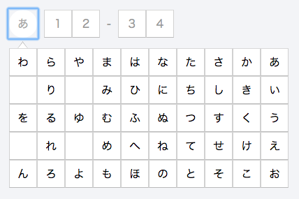

# React Hiragana Picker

## ScreenShot



## Usage

```js
import { render } from 'react-dom'
import * as React from 'react';
import HiraganaPicker from 'react-hiragana-picker';
import 'react-hiragana-picker/css/index.css';

render(
  <HiraganaPicker 
    value="あ" 
    onChange={(value) => {
      console.log(value);
    }} 
  />
  , document.getElementById('app'));
```